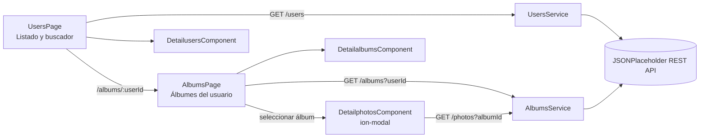

# Arquitectura de UMESUserAlbums

Las páginas gestionan navegación y estados de presentación. Los servicios concentran todas
las solicitudes HTTP y los componentes reutilizables reciben datos mediante `@Input` y
comunican acciones mediante `@Output`.